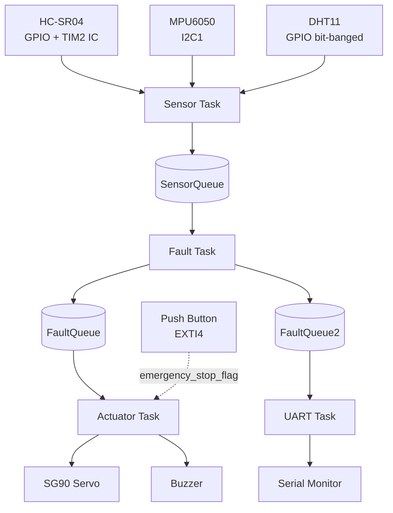

# ERCU (Embedded Robot Controller Unit)

ERCU is a FreeRTOS-based robot controller developed on the STM32F446RE. It monitors distance, tilt, temperature, and humidity using multiple sensors and controls a servo motor and buzzer based on the detected system state. An emergency stop button is implemented using an external interrupt so the actuator can be stopped immediately.

---

## Overview

The project uses three sensors:

- HC-SR04 for obstacle detection
- MPU6050 for tilt measurement
- DHT11 for temperature and humidity

Sensor readings are processed by a dedicated Fault Task, which classifies the system into one of three states:

- HEALTHY
- WARNING
- FAULT

The classification result is shared with the Actuator Task and UART Task through FreeRTOS queues. The actuator task controls the servo motor and buzzer, while the UART task prints system information for debugging.

The project was developed to practice STM32 peripheral programming, FreeRTOS task management, interrupt handling, inter-task communication, and embedded driver development.

---

## Key Features

| Feature | Description |
|----------|-------------|
| MCU | STM32F446RE (NUCLEO-64) |
| RTOS | FreeRTOS |
| Sensors | MPU6050, HC-SR04, DHT11 |
| Actuators | SG90 Servo Motor, Active Buzzer |
| Communication | I2C, UART |
| Interrupts | EXTI, TIM2 Input Capture |
| Diagnostics | UART logging with POST |

---

## Software Architecture

The application is divided into four FreeRTOS tasks.

### Sensor Task

Reads all sensors periodically and sends the measurements to the Fault Task.

### Fault Task

Evaluates the sensor data and determines whether the system is in a HEALTHY, WARNING, or FAULT state. Obstacle detection includes hysteresis to prevent repeated switching near the threshold.

### Actuator Task

Receives the classified system state and controls the servo motor and buzzer.

### UART Task

Prints sensor readings and system status to the serial terminal.

---

## Data Flow

```
Sensors
   │
   ▼
Sensor Task
   │
   ▼
Fault Task
   ├──────────────► Actuator Task
   │                     │
   │                     ├── Servo
   │                     └── Buzzer
   │
   └──────────────► UART Task
                         │
                         ▼
                  Serial Monitor

Emergency Stop (EXTI)
        │
        ▼
 Actuator Task
```

The emergency stop interrupt bypasses the normal task flow and directly notifies the Actuator Task.

---

## Architecture Block Diagram

The diagram below shows the five FreeRTOS tasks, the queues connecting them, and how each sensor/actuator peripheral attaches to the flow. The emergency stop button is wired directly into the Actuator Task through a volatile flag set in the EXTI ISR, so it is honored even if a queue is backed up.



---

## Fault Classification

| State | Condition | Action |
|--------|-----------|--------|
| HEALTHY | Normal sensor readings | Servo scans normally, buzzer off |
| WARNING | Sensor failure, obstacle between 10–30 cm, or high temperature | Reported through UART; buzzer stays off except for a slow intermittent tone during overheat |
| FAULT | Obstacle within 10 cm or emergency stop | Servo stops and buzzer turns ON continuously |

---

## Hardware

| Component | Purpose | Interface |
|-----------|---------|-----------|
| STM32F446RE | Main controller | — |
| MPU6050 | Tilt measurement | I2C1 |
| HC-SR04 | Distance measurement | GPIO + TIM2 Input Capture |
| DHT11 | Temperature & Humidity | GPIO (Bit-banged) |
| SG90 Servo | Servo control | TIM3 PWM |
| Active Buzzer | Fault indication | GPIO |
| Push Button | Emergency stop | EXTI |

---

## Pin Configuration

| Signal | Pin |
|---------|-----|
| MPU6050 SCL | PB8 |
| MPU6050 SDA | PB9 |
| HC-SR04 Trigger | PC12 |
| HC-SR04 Echo | PA1 |
| DHT11 Data | PC8 |
| Servo PWM | PA6 |
| Buzzer | PB6 |
| Emergency Stop | PC4 |
| USART2 TX | PA2 |
| USART2 RX | PA3 |

---

## Implementation

- Servo control is generated using TIM3 PWM.
- HC-SR04 echo timing is measured using TIM2 Input Capture.
- Microsecond delays are generated using the DWT cycle counter.
- Sensor communication failures are detected and reported without stopping the scheduler.
- A Power-On Self-Test (POST) verifies peripheral initialization before starting FreeRTOS.

---

## Sample UART Output

### POST

```text
[POST] MPU6050........PASS
[POST] HC-SR04........PASS
[POST] DHT11..........PASS
[POST] Servo..........OK
[POST] Buzzer.........OK

System Ready
```

### Normal Operation

```text
Distance : 42.3 cm
Tilt     : 6.1 deg
Temp/RH  : 31.8 C / 58 %

Servo    : 75 deg
Status   : HEALTHY
```

### Fault

```text
Distance : 7.8 cm

Servo    : STOPPED
Buzzer   : ON
Status   : FAULT
```

---

## Build Environment

- STM32CubeIDE 1.19+
- STM32 HAL
- FreeRTOS
- NUCLEO-F446RE
- UART terminal (115200 baud)

---

## Project Structure

```
ERCU/
├── Core/
│   ├── Inc/
│   │   ├── main.h
│   │   ├── buzzer.h
│   │   ├── hcsr04.h
│   │   ├── dht11.h
│   │   ├── servo.h
│   │   ├── mpu6050.h
│   │   ├── button.h
│   │   └── FreeRTOSConfig.h
│   └── Src/
│       ├── main.c
│       ├── freertos.c
│       ├── buzzer.c
│       ├── hcsr04.c
│       ├── dht11.c
│       ├── servo.c
│       ├── mpu6050.c
│       └── button.c
├── Drivers/          CubeMX HAL + CMSIS
├── Middlewares/      FreeRTOS
└── README.md
```

---

## Testing

Each driver (HC-SR04, MPU6050, DHT11, servo, buzzer) was verified independently
before integration. Fault paths were tested by disconnecting each sensor in turn
and confirming the system reports the correct WARNING status without crashing
or sounding the buzzer inappropriately.

The following cases were verified:

- MPU6050 communication
- HC-SR04 distance measurement
- DHT11 readings
- Servo PWM operation
- Emergency stop interrupt
- Sensor disconnection
- Obstacle detection
- Fault recovery
